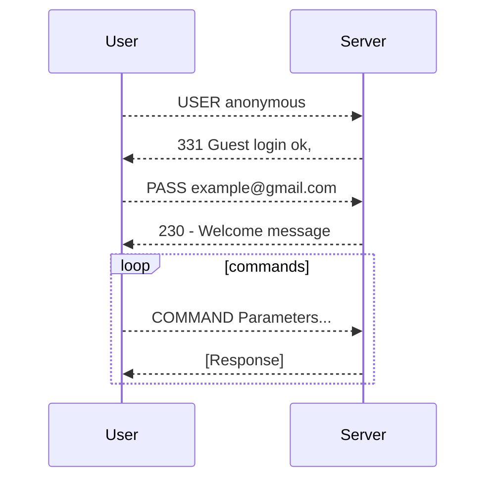

## Status of user

```mermaid
sequenceDiagram
  Participant User
  Participant Server
  User -->> Server: USER anonymous
  Server -->> User: 331 Guest login ok,
  User -->> Server: PASS example@gmail.com
  Server -->> User: 230 - Welcome message
  loop commands
    User -->> Server: COMMAND Parameters...
      Server -->> User: [Response]
  end
```

